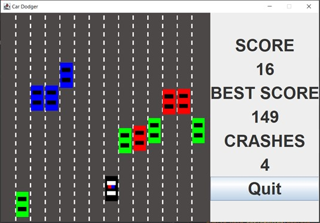

# 1.1 Car Dodger Game Clone Overview

**Overview written by Peter Mitchell.**

## Contents

```
1.1 Car Dodger Game Clone Overview
1.2 Introduction 
1.3 The Rules of Car Dodger 
1.4 High Level Discussion About Implementation 
1.5 How the Core Game Works
1.6 Features You Could Add 
```
# 1.2 Introduction

This document will explain the fundamentals of how the Car Dodger game works. 

# 1.3 The Rules of Car Dodger

The rules for Car Dodger can be summarised as the following list.

- The player starts at the bottom of the screen. It can be interacted with by pressing down on
    the mouse button, and then dragging the mouse left/right. Movement stops when the player
    releases the mouse button. Movement will also stop if the player moves the mouse too far up
    or down away from the car.
- Several cars will drive down the screen toward the player in individual lanes with maximum
    of one car per lane. The cars each have different types represented by a colour with varying
    speeds. Including one that changes speed frequently to make its movement more
    unpredictable.
- When the cars leave the bottom of the screen the player is awarded points for dodging the
    car.
- If the player hits any of the cars that are driving down the screen it counts as a crash. This is
    logged, and the game is reset back to the initial state to try and reach a best new score.


# 1.4 High Level Discussion About Implementation



The above image shows a typical view of the game as it has been developed. The lanes are animated
with the lines moving to show motion as the player’s car is moving forward. The player is the black car
in the middle, with animated alternating red/blue to make it look like a police car with lights flashing.
The different coloured cars are moving down the screen toward the player. Blue cars are the slowest,
green cars are reasonably fast, and red cars will randomly change their speed every time they move.

# 1.5 How the Core Game Works

This section will just briefly identify the significance of each class. For full detailed information about
what each class is doing review the java doc comments in each individual file.

Generic Classes:

- ActionTimer: Represents a timer that triggers after a specified period of time. Used to trigger
    animation updates on timed intervals.
- Position: Represents a single position with an x and y coordinate.
- Rectangle: Consists of a position, width, and height. To enable representation of an area
    where the Rectangle can detect points inside it and collisions with other Rectangles.

Interface Classes:

- Game: Creates the game and passes messages from the GamePanel to the StatusPanel.
- GamePanel: Manages the game objects by controlling all the cars with updates.
- StatusPanel: Shows the current status of score and crashes.


Game Elements:

- AnimatedRoad: Shows as a background to everything with segments for the road markings
    that appear to move.
- Car: A base type to represent the shared information used for both EnemyCar and PlayerCar.
- EnemyCar: A Car that can move down the screen when it updates with different car types to
    change how they look and the speed they travel at.
- EnemyCarManager: Manages the updating of all EnemyCars and makes them reset when
    necessary while checking also for collisions to trigger crashes.
- PlayerCar: Represents the player’s car that can be selected using mouse interaction from the
    GamePanel to make it move to the X coordinate of the mouse.

# 1.6 Features You Could Add

There are many individual features you could add to the game. The following list are just some of the
different features you could consider trying out.

- Add in cheat modes that change how the game appears. Some examples of cheats could be
    allowing clicking on enemy cars to make them reset, swapping the appearance of the player’s
    car to something like a tank, swapping enemy cars to change colours randomly while moving
    and many more.
- Add in difficulty modes. This could modify the number of cars that come down the screen, the
    types of enemy cars that appear, the number of total lanes, the speed of cars, or any other
    factors you wish to introduce.
- Change the cars out for images to make them more relatable as cars.
- Store the best score between game sessions so it is tracked. You could also allow storage of a
    name with it to show who achieved the score.
- Look at other similar types of games to see what features they have.


